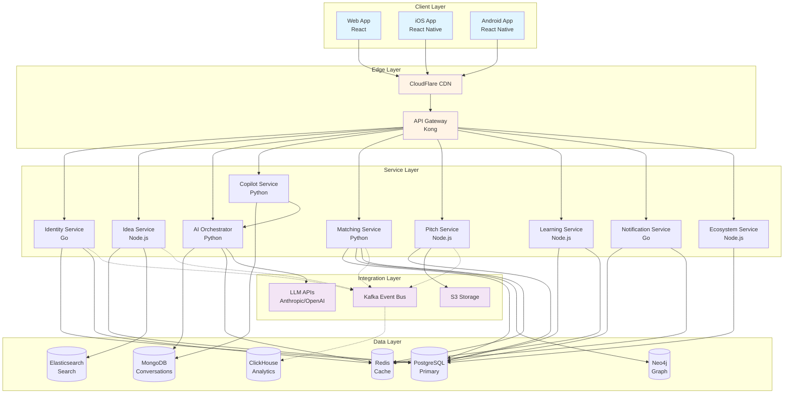
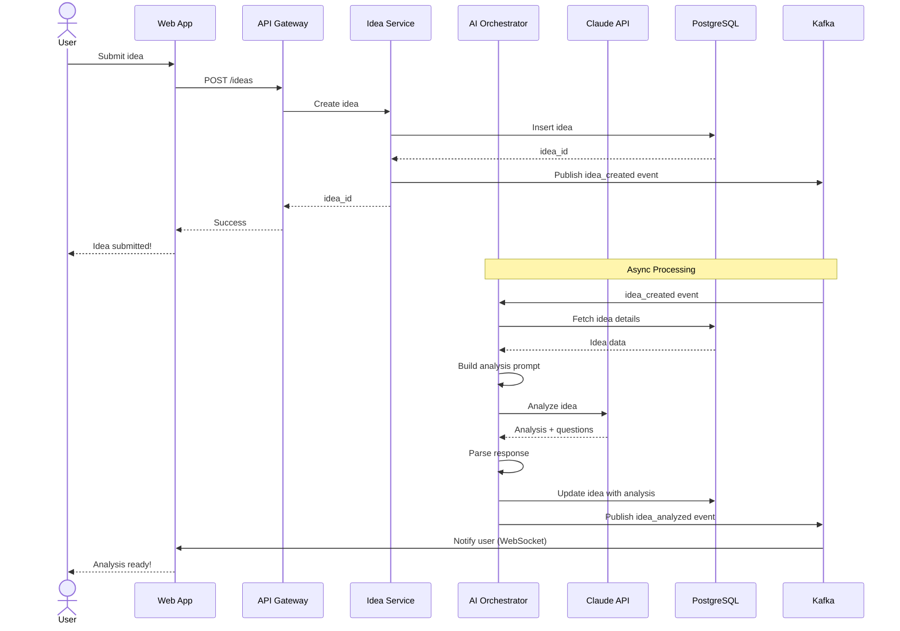
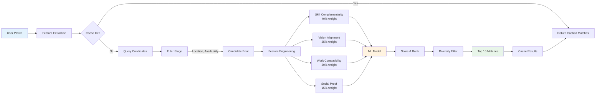
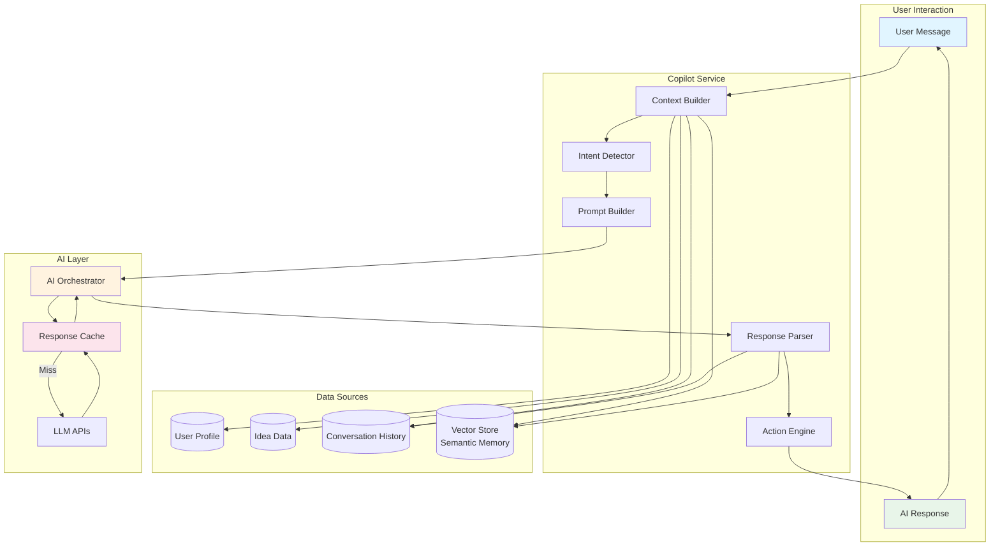
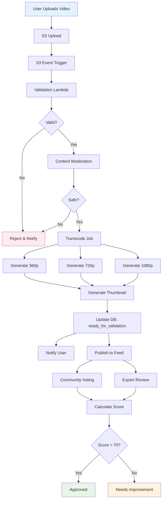
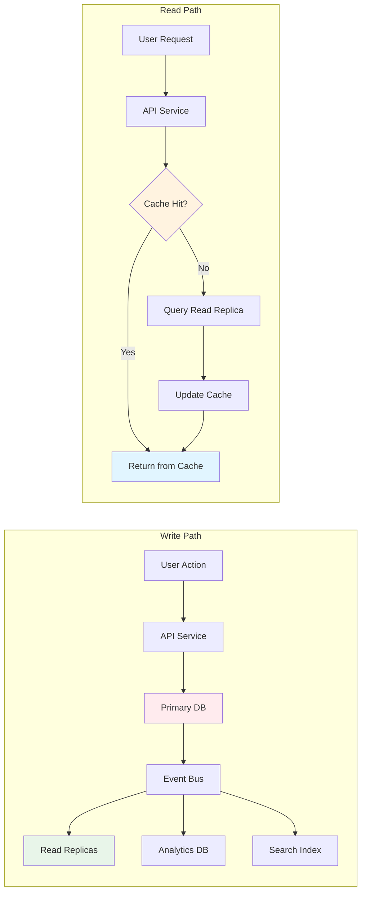
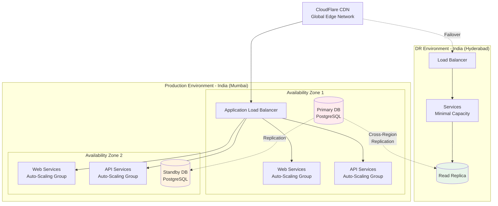
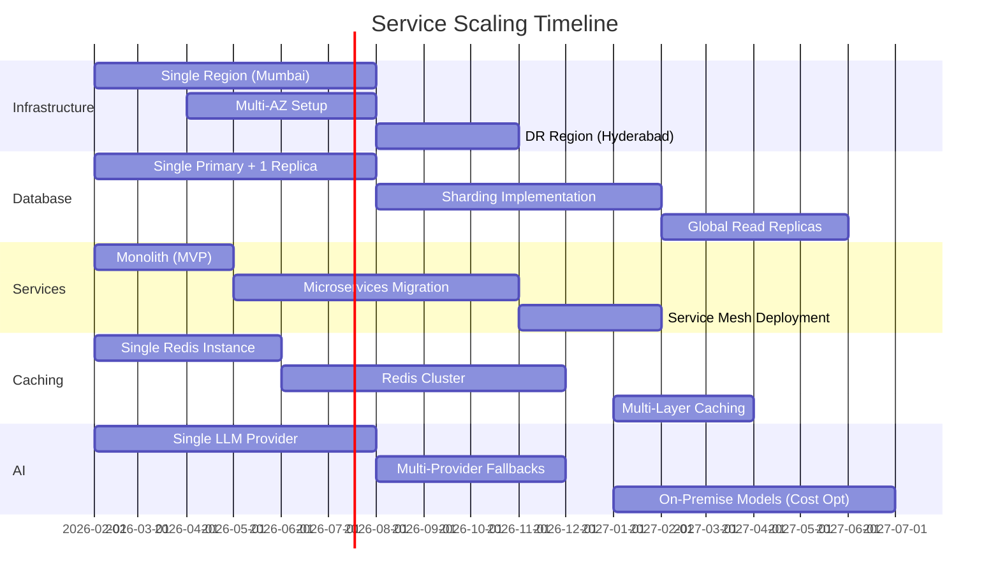

# Entrepreneurship OS - Backend Architecture
## A Production-Grade Platform for India's Startup Ecosystem

**Version:** 1.0  
**Date:** February 2026  
**Classification:** Technical Architecture Document

---

## Table of Contents

1. [Architecture Philosophy](#architecture-philosophy)
2. [High-Level System Architecture](#high-level-system-architecture)
3. [Backend Service Breakdown](#backend-service-breakdown)
4. [Database & Data Model](#database--data-model)
5. [AI System Architecture](#ai-system-architecture)
6. [Co-Founder Matching Deep Dive](#co-founder-matching-deep-dive)
7. [Security & Compliance](#security--compliance)
8. [Scalability & Future Evolution](#scalability--future-evolution)
9. [Tech Stack Justification](#tech-stack-justification)
10. [Diagrams](#diagrams)

---

## 1. Architecture Philosophy

### Executive Summary

This architecture is designed for **India's largest entrepreneurship platform**, targeting:
- **10M+ users** within 3 years
- **100K+ active founders** simultaneously
- **Sub-200ms** p95 response times across India
- **99.95%** uptime SLA
- **Multi-year evolution** without major rewrites

### Core Principles

**1. Domain-Driven Design (DDD)**
- Each bounded context is an independent microservice
- Services communicate via events and APIs
- Clear domain boundaries prevent coupling

**2. Event-Driven Architecture**
- All state changes emit events to a central event bus
- Services react to events asynchronously
- Enables real-time features and audit trails

**3. CQRS (Command Query Responsibility Segregation)**
- Separate write and read paths
- Write-optimized OLTP databases
- Read-optimized materialized views and caches

**4. Polyglot Persistence**
- Right database for each use case
- PostgreSQL for transactional data
- MongoDB for flexible schemas
- Redis for caching and real-time
- Elasticsearch for search
- Neo4j for graph relationships

**5. AI-First Architecture**
- AI capabilities as first-class services
- Vendor-agnostic AI orchestration
- Cost control and observability built-in
- Fallback mechanisms for AI failures

**6. Indian Context Optimization**
- Multi-language support (Hindi, Tamil, Telugu, Bengali, etc.)
- Mobile-first (70%+ traffic from mobile)
- Low-bandwidth optimization
- Tier 2/3 city latency consideration
- Regional data residency compliance

---

## 2. High-Level System Architecture

### Architectural Layers

```
┌─────────────────────────────────────────────────────────────┐
│                    API Gateway Layer                         │
│  (Kong / AWS API Gateway + CloudFlare CDN)                  │
└─────────────────────────────────────────────────────────────┘
                           │
                           ▼
┌─────────────────────────────────────────────────────────────┐
│                   Service Mesh Layer                         │
│              (Istio / Linkerd for service-to-service)       │
└─────────────────────────────────────────────────────────────┘
                           │
        ┌──────────────────┼──────────────────┐
        ▼                  ▼                  ▼
┌──────────────┐  ┌──────────────┐  ┌──────────────┐
│   Core       │  │   Domain     │  │  Intelligence│
│   Services   │  │   Services   │  │   Services   │
└──────────────┘  └──────────────┘  └──────────────┘
        │                  │                  │
        └──────────────────┼──────────────────┘
                           ▼
┌─────────────────────────────────────────────────────────────┐
│                    Event Bus (Kafka)                         │
└─────────────────────────────────────────────────────────────┘
                           │
        ┌──────────────────┼──────────────────┐
        ▼                  ▼                  ▼
┌──────────────┐  ┌──────────────┐  ┌──────────────┐
│  OLTP DBs    │  │  OLAP DBs    │  │   Caches     │
│ (Write Path) │  │ (Read Path)  │  │   (Redis)    │
└──────────────┘  └──────────────┘  └──────────────┘
```

### Service Categories

**Core Services** (Infrastructure)
- Identity & Access Management
- Notification Service
- File Storage Service
- Payment Service
- Analytics & Telemetry

**Domain Services** (Business Logic)
- Idea Management Service
- Founder Copilot Service
- Matching Service
- Pitch Validation Service
- Learning Service (Gamification)
- Ecosystem Orchestration Service

**Intelligence Services** (AI/ML)
- AI Orchestration Service
- NLP Service (Multi-language)
- Recommendation Engine
- Fraud Detection Service
- Video Processing Service

---

## 3. Backend Service Breakdown

### 3.1 Identity & Access Management (IAM) Service

**Responsibilities:**
- User authentication (Email/Phone/OAuth)
- Multi-role authorization
- Session management
- Profile management

**Tech Stack:**
- **Language:** Go (high-performance auth)
- **Database:** PostgreSQL (primary), Redis (sessions)
- **Auth:** Keycloak (open-source IAM) or custom JWT

**Data Model:**
```sql
-- Core user table
CREATE TABLE users (
    user_id UUID PRIMARY KEY,
    email VARCHAR(255) UNIQUE,
    phone VARCHAR(20) UNIQUE,
    password_hash VARCHAR(255),
    email_verified BOOLEAN DEFAULT FALSE,
    phone_verified BOOLEAN DEFAULT FALSE,
    created_at TIMESTAMP,
    updated_at TIMESTAMP,
    status VARCHAR(20), -- active, suspended, deleted
    CONSTRAINT chk_contact CHECK (email IS NOT NULL OR phone IS NOT NULL)
);

-- User profiles (flexible attributes)
CREATE TABLE user_profiles (
    profile_id UUID PRIMARY KEY,
    user_id UUID REFERENCES users(user_id),
    name VARCHAR(255) NOT NULL,
    age INT,
    location JSONB, -- {city, state, country, coordinates}
    college VARCHAR(255),
    company VARCHAR(255),
    linkedin_url VARCHAR(500),
    bio TEXT,
    avatar_url VARCHAR(500),
    profile_data JSONB, -- flexible schema for additional fields
    created_at TIMESTAMP,
    updated_at TIMESTAMP
);

-- Skills (normalized for matching)
CREATE TABLE user_skills (
    skill_id UUID PRIMARY KEY,
    user_id UUID REFERENCES users(user_id),
    skill_name VARCHAR(100), -- normalized: "python", "react", "product-management"
    skill_category VARCHAR(50), -- tech, marketing, finance, ops, etc.
    proficiency_level VARCHAR(20), -- beginner, intermediate, advanced, expert
    years_of_experience DECIMAL(4,2),
    verified BOOLEAN DEFAULT FALSE,
    created_at TIMESTAMP
);
CREATE INDEX idx_user_skills_user ON user_skills(user_id);
CREATE INDEX idx_user_skills_skill ON user_skills(skill_name);

-- User roles (many-to-many)
CREATE TABLE user_roles (
    user_role_id UUID PRIMARY KEY,
    user_id UUID REFERENCES users(user_id),
    role_type VARCHAR(50), -- founder, cofounder, builder, mentor, investor
    is_active BOOLEAN DEFAULT TRUE,
    metadata JSONB, -- role-specific data
    created_at TIMESTAMP
);
CREATE INDEX idx_user_roles_user ON user_roles(user_id);
CREATE INDEX idx_user_roles_type ON user_roles(role_type);

-- User preferences (for matching)
CREATE TABLE user_preferences (
    preference_id UUID PRIMARY KEY,
    user_id UUID REFERENCES users(user_id),
    risk_appetite VARCHAR(20), -- low, medium, high
    time_commitment_hours_per_week INT,
    preferred_industries JSONB, -- array of industry tags
    vision_statement TEXT,
    work_style_preferences JSONB,
    updated_at TIMESTAMP
);
```

**API Endpoints:**
```
POST   /auth/signup
POST   /auth/login
POST   /auth/oauth/{provider}/callback
POST   /auth/logout
POST   /auth/refresh
GET    /users/{userId}/profile
PATCH  /users/{userId}/profile
GET    /users/{userId}/roles
POST   /users/{userId}/roles
```

**Key Features:**
- Multi-factor authentication (OTP via SMS/Email)
- Social login (Google, LinkedIn)
- Role-based access control (RBAC)
- Session management with Redis
- Rate limiting per user/IP

---

### 3.2 Idea Management Service

**Responsibilities:**
- Idea CRUD operations
- Idea versioning & evolution
- Category tagging & search
- Privacy controls

**Tech Stack:**
- **Language:** Node.js (TypeScript)
- **Database:** PostgreSQL (primary), Elasticsearch (search)

**Data Model:**
```sql
-- Core idea table
CREATE TABLE ideas (
    idea_id UUID PRIMARY KEY,
    founder_id UUID NOT NULL, -- references users(user_id)
    title VARCHAR(255) NOT NULL,
    problem_statement TEXT NOT NULL,
    description TEXT NOT NULL,
    target_users TEXT,
    market_assumptions TEXT,
    stage VARCHAR(50), -- idea, validation, mvp, revenue, growth
    category_tags JSONB, -- array of tags
    visibility VARCHAR(20), -- private, team, public
    created_at TIMESTAMP,
    updated_at TIMESTAMP,
    version INT DEFAULT 1
);
CREATE INDEX idx_ideas_founder ON ideas(founder_id);
CREATE INDEX idx_ideas_stage ON ideas(stage);
CREATE INDEX idx_ideas_created ON ideas(created_at DESC);

-- Idea versions (for tracking evolution)
CREATE TABLE idea_versions (
    version_id UUID PRIMARY KEY,
    idea_id UUID REFERENCES ideas(idea_id),
    version_number INT,
    snapshot JSONB, -- full idea data at this version
    changed_by UUID, -- user_id
    change_reason TEXT,
    created_at TIMESTAMP
);

-- Idea team members
CREATE TABLE idea_team_members (
    team_member_id UUID PRIMARY KEY,
    idea_id UUID REFERENCES ideas(idea_id),
    user_id UUID, -- references users(user_id)
    role VARCHAR(50), -- cofounder, advisor, contributor
    joined_at TIMESTAMP,
    status VARCHAR(20) -- invited, active, left
);
```

**API Endpoints:**
```
POST   /ideas
GET    /ideas/{ideaId}
PATCH  /ideas/{ideaId}
DELETE /ideas/{ideaId}
GET    /ideas?founderId={userId}&stage={stage}
POST   /ideas/{ideaId}/team-members
GET    /ideas/{ideaId}/versions
```

---

### 3.3 AI Orchestration Service

**Responsibilities:**
- Route AI requests to appropriate models
- Manage AI vendor abstraction
- Handle prompt engineering & versioning
- Cost tracking & budgeting
- Safety & content moderation
- Retry logic & fallbacks

**Tech Stack:**
- **Language:** Python (FastAPI)
- **Database:** MongoDB (flexible schema for prompts/conversations)
- **Caching:** Redis
- **Queue:** Kafka (async AI jobs)

**Architecture Pattern:**
```
User Request
    ↓
AI Orchestrator
    ↓
┌───────┴────────┐
│  Prompt Engine │ → Version-controlled prompts
└───────┬────────┘
        ↓
┌───────┴────────┐
│ Model Router   │ → Vendor selection logic
└───────┬────────┘
        ↓
    ┌───┴───┐
    │ Anthropic│  OpenAI   │  Google   │  Local Models │
    └───┬───┘
        ↓
┌───────┴────────┐
│ Response Cache │
└───────┬────────┘
        ↓
    Validated Response
```

**Data Model:**
```javascript
// MongoDB collections

// Prompts (version-controlled)
{
  prompt_id: "uuid",
  prompt_name: "idea_analysis_v2",
  version: 2,
  template: "Analyze this startup idea...",
  model_config: {
    model: "claude-3-7-sonnet",
    temperature: 0.7,
    max_tokens: 2000
  },
  created_at: "timestamp",
  is_active: true
}

// AI Conversations (for Copilot)
{
  conversation_id: "uuid",
  user_id: "uuid",
  idea_id: "uuid",
  messages: [
    {
      role: "user",
      content: "...",
      timestamp: "..."
    },
    {
      role: "assistant",
      content: "...",
      model_used: "claude-3-7-sonnet",
      tokens_used: 150,
      cost_usd: 0.0012,
      timestamp: "..."
    }
  ],
  context: {
    idea_data: {...},
    user_profile: {...}
  },
  total_cost_usd: 0.05,
  created_at: "timestamp",
  updated_at: "timestamp"
}

// AI Usage Tracking
{
  usage_id: "uuid",
  user_id: "uuid",
  service: "idea_analysis",
  model: "claude-3-7-sonnet",
  tokens_used: 500,
  cost_usd: 0.002,
  latency_ms: 1200,
  timestamp: "timestamp",
  date: "2026-02-09" // for daily aggregation
}
```

**Key Features:**
- **Vendor Abstraction:** Switch between Anthropic, OpenAI, Google without code changes
- **Cost Control:** Per-user budgets, rate limiting
- **Prompt Management:** Version-controlled prompts with A/B testing
- **Fallback Chain:** Primary model → Backup model → Cached response → Error
- **Safety Layer:** Content moderation before/after AI generation

---

### 3.4 Founder Copilot Service

**Responsibilities:**
- Deep conversation management
- YC-style questioning
- Execution guidance
- Multi-language support

**Tech Stack:**
- **Language:** Python (FastAPI)
- **Database:** MongoDB (conversations), Redis (active sessions)
- **Vector Store:** Pinecone / Qdrant (semantic search)
- **AI:** Via AI Orchestration Service

**Conversation Flow:**
```
User Message
    ↓
Copilot Service
    ↓
┌────────────────┐
│ Context Builder│ → Fetch idea, profile, past conversations
└────────┬───────┘
         ↓
┌────────────────┐
│ Intent Detector│ → Classify: question, pivot, execution, validation
└────────┬───────┘
         ↓
┌────────────────┐
│ Prompt Builder │ → Construct context-aware prompt
└────────┬───────┘
         ↓
   AI Orchestrator
         ↓
┌────────────────┐
│ Response Parser│ → Extract actions, questions, recommendations
└────────┬───────┘
         ↓
┌────────────────┐
│  Action Engine │ → Trigger workflows (matching, validation, etc.)
└────────────────┘
```

**Memory Management:**
```javascript
// Conversation Memory (MongoDB)
{
  memory_id: "uuid",
  conversation_id: "uuid",
  user_id: "uuid",
  idea_id: "uuid",
  
  // Semantic memory (key insights)
  semantic_memory: [
    {
      insight: "User validated problem with 50 customer interviews",
      confidence: 0.95,
      timestamp: "..."
    }
  ],
  
  // Working memory (recent context, last 10 messages)
  working_memory: [...],
  
  // Long-term facts
  facts: {
    "target_market": "B2B SaaS for SMEs",
    "monthly_revenue": "₹2L",
    "team_size": 3
  },
  
  // Embeddings for semantic search
  embeddings: [...],  // 1536-dim vector
  
  updated_at: "timestamp"
}
```

**Multi-Language Support:**
- Detect language from user input
- Translate to English for AI processing
- Translate response back to user's language
- Store original + translated versions

---

### 3.5 Matching Service

**Responsibilities:**
- Co-founder matching algorithm
- Skill complementarity analysis
- Vision alignment scoring
- Personality compatibility
- Confidence scoring

**Tech Stack:**
- **Language:** Python (scikit-learn, TensorFlow)
- **Database:** PostgreSQL (user data), Neo4j (relationship graph)
- **Cache:** Redis (match results)

**Data Model (Neo4j Graph):**
```cypher
// Nodes
(User {user_id, name, skills[], experience})
(Skill {name, category})
(Idea {idea_id, category, stage})
(Industry {name})

// Relationships
(User)-[:HAS_SKILL {proficiency, years}]->(Skill)
(User)-[:WORKING_ON]->(Idea)
(User)-[:INTERESTED_IN]->(Industry)
(User)-[:MATCHED_WITH {score, timestamp}]->(User)
(User)-[:MESSAGED {count, last_message_at}]->(User)
```

**Matching Algorithm (Multi-Stage):**

**Stage 1: Candidate Filtering**
```python
def filter_candidates(founder):
    """Remove incompatible users"""
    return User.where(
        location_distance < 500km OR willing_to_relocate,
        availability > founder.min_time_commitment,
        role IN ['cofounder', 'builder'],
        NOT already_matched_with(founder),
        NOT blocked_by(founder)
    )
```

**Stage 2: Feature Extraction**
```python
features = {
    # Skill complementarity (40% weight)
    'skill_overlap': jaccard_similarity(founder.skills, candidate.skills),
    'skill_coverage': coverage_score(required_skills, combined_skills),
    'tech_business_balance': balance_score(founder, candidate),
    
    # Vision alignment (25% weight)
    'industry_match': cosine_similarity(founder.interests, candidate.interests),
    'stage_compatibility': abs(founder.preferred_stage - candidate.preferred_stage),
    'vision_embedding_similarity': cosine_similarity(
        embed(founder.vision), 
        embed(candidate.vision)
    ),
    
    # Work compatibility (20% weight)
    'risk_tolerance_match': 1 - abs(founder.risk_appetite - candidate.risk_appetite),
    'time_commitment_match': min(founder.hours, candidate.hours) / max(founder.hours, candidate.hours),
    'work_style_similarity': cosine_similarity(founder.work_style, candidate.work_style),
    
    # Social proof (15% weight)
    'platform_reputation': candidate.reputation_score,
    'mutual_connections': count_mutual_connections(founder, candidate),
    'endorsements': count_endorsements(candidate)
}
```

**Stage 3: ML-Based Scoring**
```python
# Trained on historical successful matches
match_score = xgboost_model.predict(features)

# Confidence score based on feature completeness
confidence = calculate_confidence(
    profile_completeness=candidate.profile_completeness,
    interaction_history=has_prior_interactions(founder, candidate),
    feature_coverage=feature_coverage_ratio
)
```

**Stage 4: Ranking & Presentation**
```python
# Sort by score * confidence
ranked_matches = sorted(candidates, key=lambda c: c.score * c.confidence, reverse=True)

# Apply diversity filter (don't show 10 similar profiles)
diverse_matches = diversity_filter(ranked_matches, top_n=20)

return diverse_matches[:10]
```

**Cold Start Strategy:**
- **New users:** Use content-based filtering (skills, interests) only
- **After 10 interactions:** Incorporate collaborative filtering
- **After first connection:** Learn from acceptance/rejection patterns
- **Bootstrap data:** Use LinkedIn profile data for initial matching

**PostgreSQL Tables for Matching:**
```sql
-- Match candidates (pre-computed daily)
CREATE TABLE match_candidates (
    match_id UUID PRIMARY KEY,
    user_id UUID NOT NULL,
    candidate_id UUID NOT NULL,
    match_score DECIMAL(5,4), -- 0.0000 to 1.0000
    confidence_score DECIMAL(5,4),
    feature_vector JSONB,
    computed_at TIMESTAMP,
    expires_at TIMESTAMP,
    status VARCHAR(20), -- pending, viewed, accepted, rejected
    UNIQUE(user_id, candidate_id)
);
CREATE INDEX idx_match_user_score ON match_candidates(user_id, match_score DESC);

-- Match interactions (for learning)
CREATE TABLE match_interactions (
    interaction_id UUID PRIMARY KEY,
    user_id UUID NOT NULL,
    candidate_id UUID NOT NULL,
    action VARCHAR(20), -- view, like, pass, message, connect
    timestamp TIMESTAMP
);
```

---

### 3.6 Pitch Validation Service

**Responsibilities:**
- Video upload & processing
- Content moderation
- Community voting system
- Expert feedback collection
- Approval/rejection workflow

**Tech Stack:**
- **Language:** Node.js (TypeScript)
- **Storage:** AWS S3 / Cloudflare R2 (videos)
- **Database:** PostgreSQL (metadata), Redis (voting state)
- **Video:** AWS MediaConvert / FFmpeg
- **CDN:** CloudFlare Stream

**Video Processing Pipeline:**
```
Video Upload
    ↓
┌─────────────────┐
│ Upload to S3    │ → Multipart upload, presigned URLs
└────────┬────────┘
         ↓
┌─────────────────┐
│ Generate Webhook│ → S3 event triggers Lambda
└────────┬────────┘
         ↓
┌─────────────────┐
│ Video Validation│ → Check format, duration, size
└────────┬────────┘
         ↓
┌─────────────────┐
│ Content Moderation│ → AWS Rekognition / Hive AI
└────────┬────────┘
         ↓
    [If PASS]
         ↓
┌─────────────────┐
│ Transcode       │ → Multiple resolutions (360p, 720p, 1080p)
└────────┬────────┘
         ↓
┌─────────────────┐
│ Generate Thumbnail│ → Extract frames, ML-based best frame
└────────┬────────┘
         ↓
┌─────────────────┐
│ Update Status   │ → ready_for_validation
└─────────────────┘
```

**Data Model:**
```sql
-- Pitch videos
CREATE TABLE pitch_videos (
    video_id UUID PRIMARY KEY,
    idea_id UUID REFERENCES ideas(idea_id),
    uploader_id UUID NOT NULL,
    
    -- Video metadata
    title VARCHAR(255) NOT NULL,
    description TEXT,
    duration_seconds INT,
    file_size_bytes BIGINT,
    
    -- Storage
    original_video_url VARCHAR(500),
    transcoded_urls JSONB, -- {360p: url, 720p: url, 1080p: url}
    thumbnail_url VARCHAR(500),
    
    -- Moderation
    moderation_status VARCHAR(20), -- pending, approved, rejected, flagged
    moderation_flags JSONB,
    moderated_at TIMESTAMP,
    moderated_by UUID,
    
    -- Validation
    validation_status VARCHAR(20), -- draft, live, approved, rejected
    validation_score DECIMAL(5,2), -- 0-100
    
    created_at TIMESTAMP,
    published_at TIMESTAMP
);

-- Voting (community + experts)
CREATE TABLE pitch_votes (
    vote_id UUID PRIMARY KEY,
    video_id UUID REFERENCES pitch_videos(video_id),
    voter_id UUID NOT NULL,
    voter_type VARCHAR(20), -- community, expert, mentor, investor
    
    -- Vote details
    vote_value INT, -- -1 (reject), 0 (neutral), 1 (approve)
    vote_weight DECIMAL(3,2), -- expert votes have higher weight
    
    -- Structured feedback
    feedback_categories JSONB, -- {clarity: 4, market: 3, execution: 5}
    comment TEXT,
    
    voted_at TIMESTAMP
);
CREATE INDEX idx_pitch_votes_video ON pitch_votes(video_id);
CREATE UNIQUE INDEX idx_pitch_votes_unique ON pitch_votes(video_id, voter_id);

-- Anti-gaming: Vote patterns
CREATE TABLE vote_patterns (
    pattern_id UUID PRIMARY KEY,
    voter_id UUID NOT NULL,
    suspicious_patterns JSONB, -- rapid voting, same score patterns
    risk_score DECIMAL(5,2),
    flagged BOOLEAN DEFAULT FALSE,
    reviewed_at TIMESTAMP
);
```

**Voting Algorithm:**
```python
def calculate_validation_score(video_id):
    votes = get_votes(video_id)
    
    # Weighted voting
    total_weight = 0
    weighted_sum = 0
    
    for vote in votes:
        weight = get_voter_weight(vote.voter_id, vote.voter_type)
        weighted_sum += vote.vote_value * weight
        total_weight += weight
    
    if total_weight == 0:
        return None
    
    # Normalize to 0-100
    raw_score = (weighted_sum / total_weight + 1) * 50  # -1 to 1 → 0 to 100
    
    # Apply confidence based on vote count
    confidence = min(len(votes) / 20, 1.0)  # Full confidence at 20 votes
    
    return raw_score * confidence

def get_voter_weight(voter_id, voter_type):
    base_weights = {
        'investor': 3.0,
        'expert': 2.5,
        'mentor': 2.0,
        'community': 1.0
    }
    
    reputation = get_user_reputation(voter_id)
    voting_accuracy = get_voting_accuracy(voter_id)  # historical accuracy
    
    return base_weights[voter_type] * reputation * voting_accuracy
```

**Anti-Gaming Safeguards:**
- Rate limiting (max 50 votes/day per user)
- Vote pattern detection (flag rapid voting, vote brigading)
- Captcha for suspicious accounts
- Vote weight decay for low-quality voters
- Admin review for flagged videos

---

### 3.7 Learning Service (Gamification)

**Responsibilities:**
- Duolingo-style entrepreneurship curriculum
- Progress tracking
- Achievements & badges
- Adaptive learning paths

**Tech Stack:**
- **Language:** Node.js (TypeScript)
- **Database:** PostgreSQL (progress), Redis (leaderboards)

**Data Model:**
```sql
-- Learning modules
CREATE TABLE learning_modules (
    module_id UUID PRIMARY KEY,
    title VARCHAR(255) NOT NULL,
    description TEXT,
    category VARCHAR(50), -- ideation, validation, mvp, fundraising
    difficulty_level INT, -- 1-5
    estimated_minutes INT,
    content_type VARCHAR(20), -- video, article, quiz, exercise
    content_url VARCHAR(500),
    prerequisites JSONB, -- array of module_ids
    order_index INT
);

-- User progress
CREATE TABLE user_progress (
    progress_id UUID PRIMARY KEY,
    user_id UUID NOT NULL,
    module_id UUID REFERENCES learning_modules(module_id),
    status VARCHAR(20), -- not_started, in_progress, completed
    score DECIMAL(5,2), -- 0-100 for quizzes
    time_spent_minutes INT,
    started_at TIMESTAMP,
    completed_at TIMESTAMP,
    UNIQUE(user_id, module_id)
);

-- Achievements
CREATE TABLE achievements (
    achievement_id UUID PRIMARY KEY,
    name VARCHAR(100) NOT NULL,
    description TEXT,
    badge_icon_url VARCHAR(500),
    criteria JSONB, -- unlock conditions
    points INT
);

CREATE TABLE user_achievements (
    user_achievement_id UUID PRIMARY KEY,
    user_id UUID NOT NULL,
    achievement_id UUID REFERENCES achievements(achievement_id),
    earned_at TIMESTAMP,
    UNIQUE(user_id, achievement_id)
);
```

---

### 3.8 Ecosystem Orchestration Service

**Responsibilities:**
- Partner integration (Legal, MVP builders, Marketing)
- Government funding workflows
- Service marketplace
- Request routing

**Tech Stack:**
- **Language:** Node.js (TypeScript)
- **Database:** PostgreSQL
- **Queue:** Kafka (async service requests)

**Data Model:**
```sql
-- Service providers (partners)
CREATE TABLE service_providers (
    provider_id UUID PRIMARY KEY,
    provider_name VARCHAR(255) NOT NULL,
    service_type VARCHAR(50), -- legal, mvp, marketing, funding, accounting
    description TEXT,
    pricing_model VARCHAR(20), -- fixed, hourly, percentage
    base_price DECIMAL(10,2),
    rating DECIMAL(3,2),
    total_projects INT,
    verified BOOLEAN DEFAULT FALSE,
    contact_info JSONB,
    capabilities JSONB,
    created_at TIMESTAMP
);

-- Service requests
CREATE TABLE service_requests (
    request_id UUID PRIMARY KEY,
    user_id UUID NOT NULL,
    idea_id UUID,
    service_type VARCHAR(50),
    description TEXT,
    requirements JSONB,
    budget_range JSONB, -- {min, max, currency}
    status VARCHAR(20), -- draft, submitted, matched, in_progress, completed, cancelled
    assigned_provider_id UUID REFERENCES service_providers(provider_id),
    created_at TIMESTAMP,
    updated_at TIMESTAMP
);

-- Government funding workflows
CREATE TABLE funding_applications (
    application_id UUID PRIMARY KEY,
    user_id UUID NOT NULL,
    idea_id UUID REFERENCES ideas(idea_id),
    scheme_name VARCHAR(255), -- Startup India, SISFS, NABARD, etc.
    scheme_type VARCHAR(50), -- seed_fund, loan, grant, subsidy
    amount_requested DECIMAL(12,2),
    application_data JSONB, -- scheme-specific fields
    status VARCHAR(20), -- draft, submitted, under_review, approved, rejected
    submitted_at TIMESTAMP,
    decision_at TIMESTAMP
);
```

---

### 3.9 Notification Service

**Responsibilities:**
- Multi-channel notifications (Email, SMS, Push, In-app)
- Template management
- Delivery tracking
- User preferences

**Tech Stack:**
- **Language:** Go
- **Database:** PostgreSQL (templates), Redis (queues)
- **Email:** AWS SES / SendGrid
- **SMS:** Twilio / MSG91 (India-focused)
- **Push:** Firebase Cloud Messaging

**Data Model:**
```sql
-- Notification templates
CREATE TABLE notification_templates (
    template_id UUID PRIMARY KEY,
    template_name VARCHAR(100) NOT NULL,
    channel VARCHAR(20), -- email, sms, push, in_app
    language VARCHAR(10), -- en, hi, ta, te
    subject VARCHAR(255), -- for email
    body_template TEXT, -- with {{variables}}
    created_at TIMESTAMP,
    is_active BOOLEAN DEFAULT TRUE
);

-- Notification queue
CREATE TABLE notification_queue (
    notification_id UUID PRIMARY KEY,
    user_id UUID NOT NULL,
    template_id UUID REFERENCES notification_templates(template_id),
    channel VARCHAR(20),
    recipient VARCHAR(255), -- email/phone/device_token
    variables JSONB, -- template variables
    priority INT, -- 1 (high) to 5 (low)
    scheduled_at TIMESTAMP,
    sent_at TIMESTAMP,
    status VARCHAR(20), -- pending, sent, failed, retrying
    retry_count INT DEFAULT 0,
    error_message TEXT
);

-- User notification preferences
CREATE TABLE user_notification_preferences (
    preference_id UUID PRIMARY KEY,
    user_id UUID NOT NULL,
    notification_type VARCHAR(50), -- match_found, pitch_feedback, etc.
    email_enabled BOOLEAN DEFAULT TRUE,
    sms_enabled BOOLEAN DEFAULT FALSE,
    push_enabled BOOLEAN DEFAULT TRUE,
    in_app_enabled BOOLEAN DEFAULT TRUE,
    frequency VARCHAR(20), -- real_time, daily_digest, weekly_digest
    updated_at TIMESTAMP
);
```

---

### 3.10 Analytics & Telemetry Service

**Responsibilities:**
- Event tracking
- User behavior analytics
- Product metrics
- Business intelligence

**Tech Stack:**
- **Language:** Python (FastAPI)
- **Event Stream:** Kafka
- **OLAP:** ClickHouse / Apache Druid
- **Visualization:** Metabase / Superset

**Event Schema:**
```javascript
{
  event_id: "uuid",
  event_name: "idea_submitted", // standardized event names
  user_id: "uuid",
  session_id: "uuid",
  timestamp: "2026-02-09T10:30:00Z",
  
  // Context
  platform: "web", // web, ios, android
  device: {...},
  location: {...},
  
  // Event-specific properties
  properties: {
    idea_id: "uuid",
    idea_stage: "validation",
    idea_category: "fintech"
  },
  
  // For A/B testing
  experiments: [
    {experiment_id: "new_matching_algo", variant: "B"}
  ]
}
```

---

## 4. Database & Data Model

### 4.1 Database Selection Strategy

**PostgreSQL** (Primary OLTP)
- **Use For:** Users, Ideas, Matches, Transactions
- **Why:** ACID compliance, complex joins, JSON support
- **Instances:** Multi-AZ RDS with read replicas

**MongoDB** (Flexible Schema)
- **Use For:** AI conversations, prompts, logs
- **Why:** Flexible schema, high write throughput
- **Instances:** Atlas (managed) with sharding

**Redis** (Cache & Real-time)
- **Use For:** Sessions, leaderboards, rate limiting
- **Why:** Sub-millisecond latency, atomic operations
- **Instances:** ElastiCache cluster mode

**Neo4j** (Graph Database)
- **Use For:** Social graph, co-founder matching
- **Why:** Relationship queries, graph algorithms
- **Instances:** Aura (managed) or self-hosted

**Elasticsearch** (Search Engine)
- **Use For:** Full-text search (ideas, users, content)
- **Why:** Fast text search, faceted search, relevance scoring
- **Instances:** Elastic Cloud or AWS OpenSearch

**ClickHouse** (Analytics OLAP)
- **Use For:** Event analytics, time-series data
- **Why:** Columnar storage, extremely fast aggregations
- **Instances:** ClickHouse Cloud or self-hosted

### 4.2 Data Flow Architecture

```
Write Path:
User Action → API → Service → Primary DB → Event Bus (Kafka)
                                              ↓
                                    ┌─────────┴─────────┐
                                    ↓                   ↓
                            Read DB (Replica)    Analytics DB (ClickHouse)

Read Path:
User Request → API → Cache (Redis) → [Cache Miss] → Read Replica → Response
```

### 4.3 Indexing Strategy

**Core Principles:**
- Index all foreign keys
- Index columns used in WHERE, JOIN, ORDER BY
- Composite indexes for multi-column queries
- Partial indexes for filtered queries
- Avoid over-indexing (slows writes)

**Example Indexes:**
```sql
-- Users
CREATE INDEX idx_users_email ON users(email) WHERE email IS NOT NULL;
CREATE INDEX idx_users_phone ON users(phone) WHERE phone IS NOT NULL;
CREATE INDEX idx_users_status ON users(status) WHERE status = 'active';

-- Ideas
CREATE INDEX idx_ideas_founder_stage ON ideas(founder_id, stage);
CREATE INDEX idx_ideas_category ON ideas USING GIN(category_tags); -- JSONB array
CREATE INDEX idx_ideas_created_desc ON ideas(created_at DESC);

-- Matches
CREATE INDEX idx_matches_user_score ON match_candidates(user_id, match_score DESC) 
  WHERE status = 'pending';
```

### 4.4 Partitioning Strategy

**Time-based Partitioning:**
```sql
-- Events table (ClickHouse)
CREATE TABLE events (
    event_id UUID,
    event_name String,
    user_id UUID,
    timestamp DateTime,
    properties String -- JSON
) ENGINE = MergeTree()
PARTITION BY toYYYYMM(timestamp) -- Monthly partitions
ORDER BY (event_name, user_id, timestamp);

-- Auto-drop old partitions
ALTER TABLE events DROP PARTITION '202401'; -- Drop Jan 2024 data
```

### 4.5 Backup & Disaster Recovery

**RTO (Recovery Time Objective):** 1 hour  
**RPO (Recovery Point Objective):** 5 minutes

**Strategy:**
- **PostgreSQL:** Automated daily snapshots + Point-in-Time Recovery (PITR)
- **MongoDB:** Continuous backup with Atlas
- **Redis:** RDB snapshots every 5 minutes + AOF
- **Cross-region replication:** DR region (read-only standby)

---

## 5. AI System Architecture

### 5.1 AI Service Topology

```
┌─────────────────────────────────────────────────────────┐
│                  AI Gateway Layer                       │
│  (Request validation, auth, rate limiting, caching)     │
└─────────────────────┬───────────────────────────────────┘
                      ↓
┌─────────────────────────────────────────────────────────┐
│               AI Orchestration Service                  │
│  - Prompt management                                    │
│  - Model routing                                        │
│  - Cost tracking                                        │
│  - Response validation                                  │
└────────┬────────────────────────┬───────────────────────┘
         ↓                        ↓
┌──────────────────┐    ┌──────────────────┐
│  LLM Providers   │    │  Specialized AI  │
│  - Anthropic     │    │  - NLP (spaCy)   │
│  - OpenAI        │    │  - Embeddings    │
│  - Google        │    │  - Translation   │
│  - Mistral       │    │  - Moderation    │
└──────────────────┘    └──────────────────┘
```

### 5.2 AI Use Cases & Models

| Use Case | Model | Why |
|----------|-------|-----|
| Founder Copilot | Claude 3.7 Sonnet | Long context, nuanced reasoning |
| Idea Analysis | Claude 3 Haiku | Fast, cost-effective |
| Vision Matching | OpenAI Embeddings | Best embedding quality |
| Translation | Google Translate API | Multi-language, low cost |
| Content Moderation | Hive AI / AWS Rekognition | Specialized, compliant |
| Skill Extraction | spaCy NER (custom) | On-premise, fast |

### 5.3 Prompt Engineering Framework

**Prompt Structure:**
```python
system_prompt = """
You are an expert startup advisor with 20 years of experience.
You ask probing questions like Paul Graham (YC).
You are direct, honest, and supportive.

Context:
- Platform: Indian Entrepreneurship OS
- User Stage: {user_stage}
- Conversation Phase: {phase}
"""

user_context = """
Founder Profile:
- Name: {name}
- Background: {background}
- Skills: {skills}

Idea:
{idea_details}

Conversation History:
{last_5_messages}
"""

task_prompt = """
The founder just said: "{user_message}"

Generate:
1. A thoughtful response (2-3 sentences)
2. One probing question that challenges assumptions
3. One actionable next step

Format as JSON.
"""
```

**Version Control:**
- Store prompts in MongoDB with versioning
- A/B test prompts (track user satisfaction, conversation length)
- Rollback mechanism for bad prompts

### 5.4 Cost Optimization

**Strategies:**
1. **Tiered Model Selection**
   - Simple tasks → Haiku/GPT-3.5 ($0.25/1M tokens)
   - Complex tasks → Sonnet ($3/1M tokens)
   - Critical tasks → Opus ($15/1M tokens)

2. **Aggressive Caching**
   - Cache common questions (Redis with 24hr TTL)
   - Semantic cache (embed question, check similarity)
   - Response templates for FAQs

3. **Rate Limiting**
   - Free tier: 50 AI interactions/day
   - Pro tier: 500 AI interactions/day
   - Per-user budget tracking

4. **Prompt Optimization**
   - Minimize token usage (remove verbose instructions)
   - Use few-shot examples sparingly
   - Compress conversation history (summarize old messages)

**Cost Monitoring:**
```sql
-- Daily AI cost tracking
CREATE TABLE ai_cost_tracking (
    date DATE,
    service VARCHAR(50),
    model VARCHAR(50),
    total_tokens BIGINT,
    total_cost_usd DECIMAL(10,4),
    request_count INT,
    PRIMARY KEY (date, service, model)
);

-- Alerts when daily cost > $500
CREATE TRIGGER ai_cost_alert 
AFTER INSERT ON ai_cost_tracking
FOR EACH ROW
WHEN (NEW.total_cost_usd > 500)
EXECUTE FUNCTION send_cost_alert();
```

### 5.5 Safety & Hallucination Mitigation

**Input Validation:**
- Content moderation before processing
- PII detection and masking
- Prompt injection detection

**Output Validation:**
- Fact-checking for factual claims
- Confidence scores for recommendations
- Human-in-the-loop for critical outputs

**Fallbacks:**
- If AI fails, return cached/template response
- If confidence < 0.7, add disclaimer
- Escalate to human support for sensitive topics

---

## 6. Co-Founder Matching Deep Dive

### 6.1 Matching Philosophy

Traditional matching (Tinder, LinkedIn) is based on **surface-level signals**.

Our matching is **deep, multi-dimensional, and outcome-focused**:
- **Skill complementarity** (not similarity)
- **Vision alignment** (semantic, not keyword-based)
- **Work compatibility** (risk, time, style)
- **Social proof** (reputation, endorsements)

### 6.2 Data Inputs

```python
# User inputs (explicit)
user_profile = {
    "skills": ["python", "machine-learning", "product-design"],
    "experience_years": 5,
    "availability_hours_per_week": 40,
    "risk_appetite": "high",  # low, medium, high
    "preferred_industries": ["fintech", "healthtech"],
    "vision_statement": "I want to build AI-powered financial tools for the next billion users",
    "work_style": {
        "remote_preference": "hybrid",
        "decision_making": "data-driven",
        "communication_style": "direct"
    }
}

# Platform behaviors (implicit)
user_behaviors = {
    "ideas_submitted": 3,
    "avg_idea_quality_score": 7.5,
    "pitch_video_uploaded": True,
    "learning_modules_completed": 15,
    "community_engagement_score": 8.2,
    "response_rate": 0.85,  # % of messages responded to
    "collaboration_history": [...]  # past matches, outcomes
}
```

### 6.3 Feature Engineering

```python
def engineer_features(founder, candidate):
    features = {}
    
    # 1. Skill Complementarity (40% weight)
    founder_skills = set(founder.skills)
    candidate_skills = set(candidate.skills)
    
    features['skill_overlap'] = len(founder_skills & candidate_skills) / len(founder_skills | candidate_skills)
    features['skill_coverage'] = coverage_score(IDEAL_STARTUP_SKILLS, founder_skills | candidate_skills)
    features['tech_business_balance'] = balance_score(founder, candidate)
    
    # 2. Vision Alignment (25% weight)
    founder_embedding = get_embedding(founder.vision_statement)
    candidate_embedding = get_embedding(candidate.vision_statement)
    features['vision_similarity'] = cosine_similarity(founder_embedding, candidate_embedding)
    
    features['industry_overlap'] = len(set(founder.preferred_industries) & set(candidate.preferred_industries))
    
    # 3. Work Compatibility (20% weight)
    features['risk_tolerance_delta'] = abs(RISK_SCORES[founder.risk_appetite] - RISK_SCORES[candidate.risk_appetite])
    features['time_commit_ratio'] = min(founder.availability, candidate.availability) / max(founder.availability, candidate.availability)
    features['work_style_similarity'] = work_style_score(founder.work_style, candidate.work_style)
    
    # 4. Social Proof (15% weight)
    features['candidate_reputation'] = candidate.reputation_score
    features['mutual_connections'] = count_mutual(founder, candidate)
    features['endorsement_count'] = len(candidate.endorsements)
    
    # 5. Behavioral Signals
    features['response_rate'] = candidate.response_rate
    features['platform_activity'] = candidate.engagement_score
    
    return features
```

### 6.4 Machine Learning Pipeline

**Training Data:**
- Successful matches (co-founders who worked together for 6+ months)
- Failed matches (stopped collaborating within 3 months)
- Features at time of match

**Model:**
```python
import xgboost as xgb

# Train model
X_train = [feature_vectors...]
y_train = [1 if successful else 0...]

model = xgb.XGBClassifier(
    objective='binary:logistic',
    max_depth=6,
    learning_rate=0.1,
    n_estimators=100
)

model.fit(X_train, y_train)

# Feature importance
importance = model.feature_importances_
```

**Inference:**
```python
def score_match(founder_id, candidate_id):
    features = engineer_features(founder_id, candidate_id)
    feature_vector = vectorize(features)
    
    # Probability of successful match
    match_probability = model.predict_proba(feature_vector)[0][1]
    
    # Confidence based on feature completeness
    completeness = calculate_completeness(features)
    confidence = completeness * (1 - abs(0.5 - match_probability))  # Higher confidence when not near 0.5
    
    return {
        "score": match_probability,
        "confidence": confidence,
        "features": features,
        "explanation": generate_explanation(features)
    }
```

### 6.5 Explainability

```python
def generate_explanation(features):
    """Generate human-readable match explanation"""
    
    explanations = []
    
    if features['skill_overlap'] < 0.3:
        explanations.append("Strong skill complementarity - you cover different areas")
    
    if features['vision_similarity'] > 0.8:
        explanations.append("Highly aligned vision and goals")
    
    if features['work_style_similarity'] > 0.7:
        explanations.append("Compatible work styles and preferences")
    
    if features['mutual_connections'] > 5:
        explanations.append(f"{features['mutual_connections']} mutual connections")
    
    return explanations
```

### 6.6 Continuous Learning

**Feedback Loop:**
```python
# Track match outcomes
def record_match_outcome(match_id, outcome):
    """
    Outcomes:
    - 'message_sent': Founder initiated contact
    - 'connected': Both agreed to collaborate
    - 'active_6mo': Still working together after 6 months
    - 'inactive': Stopped collaborating
    - 'rejected': Founder passed on match
    """
    
    match = get_match(match_id)
    
    # Store outcome
    db.insert('match_outcomes', {
        'match_id': match_id,
        'outcome': outcome,
        'timestamp': now(),
        'features': match.features
    })
    
    # Retrain model quarterly with new data
    if should_retrain():
        retrain_matching_model()
```

---

## 7. Security & Compliance

### 7.1 Authentication & Authorization

**Authentication:**
- **JWT** with short-lived access tokens (15 min) + long-lived refresh tokens (30 days)
- **OAuth 2.0** for social login (Google, LinkedIn)
- **OTP** for phone verification (6-digit code, 5-min expiry)
- **Multi-factor authentication** for sensitive operations

**Authorization:**
- **Role-Based Access Control (RBAC)**
- **Attribute-Based Access Control (ABAC)** for fine-grained permissions
- **Service-to-service auth** via mutual TLS (mTLS)

```python
# Example RBAC policy
permissions = {
    "founder": ["create_idea", "submit_pitch", "view_matches"],
    "cofounder": ["view_idea", "edit_idea", "invite_team"],
    "mentor": ["view_pitch", "provide_feedback"],
    "investor": ["view_pitch", "contact_founder"],
    "admin": ["*"]  # all permissions
}
```

### 7.2 Data Privacy & Compliance

**Indian Regulations:**
- **Digital Personal Data Protection Act (DPDPA) 2023**
- **IT Act 2000 & Amendment 2008**

**Key Requirements:**
1. **Data Localization:**
   - All user data stored in Indian data centers (AWS Mumbai, Azure India)
   - Cross-border transfers only with consent

2. **User Consent:**
   - Explicit consent for data collection
   - Granular consent for different data types
   - Easy consent withdrawal

3. **Right to Access & Deletion:**
   - API for users to download their data
   - API for users to request account deletion (GDPR-style)

4. **Data Minimization:**
   - Collect only necessary data
   - Anonymize data for analytics

**Implementation:**
```sql
-- Consent tracking
CREATE TABLE user_consents (
    consent_id UUID PRIMARY KEY,
    user_id UUID NOT NULL,
    consent_type VARCHAR(50), -- data_collection, marketing, ai_processing
    granted BOOLEAN,
    granted_at TIMESTAMP,
    revoked_at TIMESTAMP,
    version INT -- consent policy version
);

-- Data access logs (audit trail)
CREATE TABLE data_access_logs (
    log_id UUID PRIMARY KEY,
    user_id UUID,
    accessor_id UUID, -- who accessed
    data_type VARCHAR(50), -- profile, idea, pitch_video
    action VARCHAR(20), -- read, update, delete
    ip_address VARCHAR(45),
    timestamp TIMESTAMP,
    purpose TEXT
);
```

### 7.3 Security Best Practices

**Application Security:**
- Input validation & sanitization
- Parameterized queries (prevent SQL injection)
- Rate limiting (prevent DDoS)
- CORS policies
- Content Security Policy (CSP) headers

**Data Security:**
- **Encryption at rest:** AES-256 for databases
- **Encryption in transit:** TLS 1.3
- **Field-level encryption:** PII (Aadhaar, phone numbers)
- **Key rotation:** Every 90 days

**Infrastructure Security:**
- **VPC isolation:** Services in private subnets
- **Security groups:** Whitelist-based firewall rules
- **Secrets management:** AWS Secrets Manager / HashiCorp Vault
- **Vulnerability scanning:** Regular scans with Snyk / Trivy

**Example: Field-Level Encryption:**
```python
from cryptography.fernet import Fernet

# Encrypt sensitive fields before storing
def encrypt_pii(data, field_name):
    key = get_encryption_key(field_name)
    fernet = Fernet(key)
    encrypted = fernet.encrypt(data.encode())
    return encrypted

# Store in DB
user = {
    "user_id": "uuid",
    "email": "plain@example.com",  # not PII in India
    "phone": encrypt_pii("+919876543210", "phone"),  # PII
    "aadhaar": encrypt_pii("123456781234", "aadhaar")  # sensitive PII
}
```

### 7.4 Incident Response

**Incident Categories:**
- **P0:** Data breach, service down
- **P1:** Security vulnerability, partial outage
- **P2:** Performance degradation
- **P3:** Minor bugs

**Response Playbook:**
1. **Detect:** Automated monitoring alerts
2. **Assess:** Incident commander assesses severity
3. **Contain:** Isolate affected systems
4. **Communicate:** Notify users if data breach
5. **Remediate:** Fix root cause
6. **Post-Mortem:** Document learnings

---

## 8. Scalability & Future Evolution

### 8.1 Scaling Strategy

**Horizontal Scaling:**
- **Stateless services:** Easy to add more instances
- **Load balancing:** Application Load Balancer (ALB)
- **Auto-scaling:** Based on CPU, memory, request rate

**Vertical Scaling:**
- **Databases:** Increase instance size as needed
- **Caching:** Increase Redis cluster size

**Database Scaling:**
```
Stage 1 (0-100K users):
- Single PostgreSQL instance (db.r5.2xlarge)
- No read replicas needed

Stage 2 (100K-1M users):
- Primary + 2 read replicas
- Read/write splitting in application

Stage 3 (1M-10M users):
- Sharding by user_id (hash-based)
- 4 primary shards + read replicas per shard
- Global query router

Stage 4 (10M+ users):
- Multi-region deployment
- Regional sharding + global routing
```

**Caching Layers:**
```
L1: Application-level cache (in-memory, per-instance)
L2: Redis cluster (distributed)
L3: CDN (CloudFlare) for static assets
```

### 8.2 Performance Targets

| Metric | Target | Strategy |
|--------|--------|----------|
| API Response Time (p95) | < 200ms | Caching, DB indexing, query optimization |
| API Response Time (p99) | < 500ms | Auto-scaling, circuit breakers |
| Page Load Time | < 2s | CDN, lazy loading, code splitting |
| AI Response Time | < 3s | Model optimization, streaming responses |
| Database Query Time | < 50ms | Indexes, query optimization, connection pooling |
| Search Query Time | < 100ms | Elasticsearch tuning, sharding |

### 8.3 Monitoring & Observability

**Three Pillars:**
1. **Metrics:** Time-series data (Prometheus + Grafana)
2. **Logs:** Centralized logging (ELK / Loki)
3. **Traces:** Distributed tracing (Jaeger / Tempo)

**Key Metrics:**
```yaml
# Application metrics
- Request rate (req/sec)
- Error rate (%)
- Latency (p50, p95, p99)
- Concurrent users

# Business metrics
- Daily Active Users (DAU)
- Ideas submitted per day
- Match acceptance rate
- Video upload success rate
- AI conversation length

# Infrastructure metrics
- CPU/Memory utilization
- Disk I/O
- Network throughput
- Database connection pool size
```

**Alerting:**
```yaml
# Critical alerts (PagerDuty)
- Error rate > 1%
- API latency p99 > 1s
- Database connection pool > 90%
- Any service down

# Warning alerts (Slack)
- Error rate > 0.5%
- API latency p95 > 500ms
- Disk usage > 80%
```

### 8.4 Deployment Strategy

**CI/CD Pipeline:**
```
Code Push → GitHub
    ↓
GitHub Actions triggered
    ↓
Run tests (unit, integration)
    ↓
Build Docker image
    ↓
Push to container registry (ECR)
    ↓
Deploy to staging (ECS/K8s)
    ↓
Run smoke tests
    ↓
Manual approval
    ↓
Blue-green deployment to production
    ↓
Health checks
    ↓
Route traffic gradually (10% → 50% → 100%)
    ↓
Monitor for errors
    ↓
[If errors] Automatic rollback
```

**Feature Flags:**
```python
# Example: LaunchDarkly / Unleash
if feature_enabled('new_matching_algorithm', user_id):
    matches = new_matching_algorithm(user_id)
else:
    matches = old_matching_algorithm(user_id)
```

**Database Migrations:**
```python
# Alembic (Python) / Flyway (Java)
# Version-controlled, reversible migrations

# Example: Add column without downtime
# Step 1: Add nullable column
ALTER TABLE users ADD COLUMN last_login TIMESTAMP NULL;

# Step 2: Backfill data (batch job)
UPDATE users SET last_login = created_at WHERE last_login IS NULL;

# Step 3: Make column non-nullable
ALTER TABLE users ALTER COLUMN last_login SET NOT NULL;
```

### 8.5 Future Evolution

**Phase 1 (Months 1-6): MVP**
- Core services (IAM, Idea, Matching, AI Copilot)
- Basic pitch validation
- Simple learning modules

**Phase 2 (Months 7-12): Growth**
- Advanced matching algorithm (ML-based)
- Video analytics
- Ecosystem partnerships (Legal, MVP)
- Regional language support

**Phase 3 (Year 2): Scale**
- Multi-city events & communities
- Investor network integration
- Advanced analytics & insights
- API for third-party integrations

**Phase 4 (Year 3+): Platform**
- International expansion (Southeast Asia)
- Acquisition marketplace
- Alumni network & success stories
- Enterprise tier for incubators

---

## 9. Tech Stack Justification

### 9.1 Programming Languages

| Language | Use Case | Why |
|----------|----------|-----|
| **Go** | IAM, Notification, Payment | High performance, low latency, excellent concurrency |
| **Node.js (TypeScript)** | Idea, Pitch, Learning | Fast development, excellent for I/O-bound tasks |
| **Python (FastAPI)** | AI, ML, Analytics | Rich AI/ML ecosystem, fast for data processing |
| **React** | Web Frontend | Industry standard, component-based, rich ecosystem |
| **React Native** | Mobile Apps | Code sharing with web, native performance |

### 9.2 Databases

| Database | Use Case | Why |
|----------|----------|-----|
| **PostgreSQL** | Primary OLTP | ACID, JSON support, mature ecosystem |
| **MongoDB** | AI conversations, logs | Flexible schema, high write throughput |
| **Redis** | Cache, sessions, queues | Sub-ms latency, atomic operations |
| **Neo4j** | Social graph, matching | Native graph queries, relationship traversal |
| **Elasticsearch** | Full-text search | Best-in-class search, facets, relevance |
| **ClickHouse** | Analytics, events | Columnar, extremely fast aggregations |

### 9.3 Infrastructure

| Component | Technology | Why |
|-----------|------------|-----|
| **Cloud Provider** | AWS (primary) | Mature India presence, comprehensive services |
| **Containers** | Docker + ECS / Kubernetes | Portability, resource efficiency |
| **API Gateway** | Kong / AWS API Gateway | Rate limiting, auth, routing |
| **Service Mesh** | Istio / Linkerd | Service-to-service security, observability |
| **CDN** | CloudFlare | Global edge network, DDoS protection |
| **Message Queue** | Kafka | High throughput, durable, replay-able |
| **Object Storage** | S3 / R2 | Scalable, durable, cost-effective |
| **Monitoring** | Prometheus + Grafana | Open-source, flexible, powerful |
| **Logging** | ELK / Loki | Centralized, searchable logs |
| **Tracing** | Jaeger / Tempo | Distributed tracing, performance debugging |

### 9.4 AI & ML

| Component | Technology | Why |
|-----------|------------|-----|
| **LLM** | Claude 3.7 Sonnet | Best reasoning, long context |
| **Fast LLM** | Claude 3 Haiku | Cost-effective, fast |
| **Embeddings** | OpenAI text-embedding-3-large | High quality embeddings |
| **Translation** | Google Translate API | Best multi-language support |
| **Moderation** | Hive AI / AWS Rekognition | Specialized, compliant |
| **ML Framework** | scikit-learn, XGBoost | Production-ready, performant |
| **Vector DB** | Pinecone / Qdrant | Semantic search, similarity matching |

---

## 10. Diagrams

### 10.1 High-Level System Architecture



### 10.2 Idea Submission & AI Analysis Flow



### 10.3 Co-Founder Matching Flow



### 10.4 AI Copilot Architecture



### 10.5 Video Pitch Validation Pipeline



### 10.6 Data Flow: Write & Read Paths



### 10.7 Deployment Architecture



### 10.8 Scaling Roadmap



---

## Conclusion

This architecture is designed to support India's largest entrepreneurship platform, handling **millions of users** while maintaining:

✅ **Scalability:** Horizontal scaling at every layer  
✅ **Reliability:** 99.95% uptime with multi-AZ deployment  
✅ **Performance:** Sub-200ms API responses  
✅ **Security:** India-compliant data protection  
✅ **Maintainability:** Modular microservices with clear boundaries  
✅ **Cost-Efficiency:** Intelligent AI usage, tiered infrastructure  
✅ **Evolvability:** Designed for 5-10 year lifecycle  

**Key Differentiators:**
- **AI-First:** Deep AI integration, not bolted-on chatbot
- **Serious Matching:** ML-based complementarity, not keyword filters
- **Indian Context:** Multi-language, tier 2/3 optimization, regional compliance
- **Production-Ready:** Not a hackathon MVP, built for scale

**Next Steps:**
1. **Phase 1 (Months 1-3):** Implement core services (IAM, Idea, AI Copilot)
2. **Phase 2 (Months 4-6):** Add Matching, Pitch Validation, Learning
3. **Phase 3 (Months 7-12):** Optimize ML models, scale infrastructure
4. **Phase 4 (Year 2+):** Ecosystem integrations, international expansion

---

**Document Metadata:**
- **Author:** Senior Backend Architect
- **Target Audience:** Engineering team, Investors, Incubators
- **Review Cycle:** Quarterly updates as platform evolves
- **Status:** Ready for Implementation

